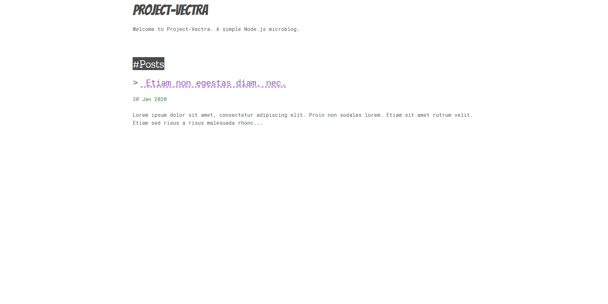
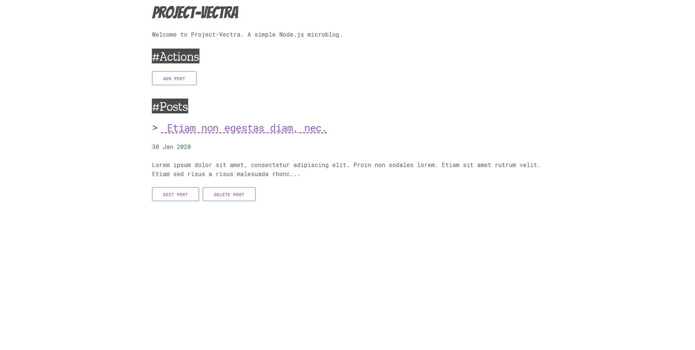
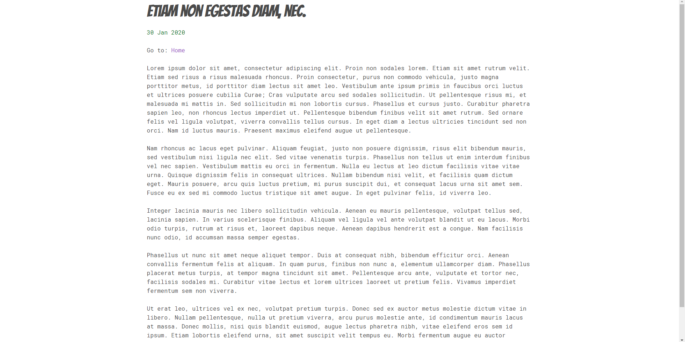
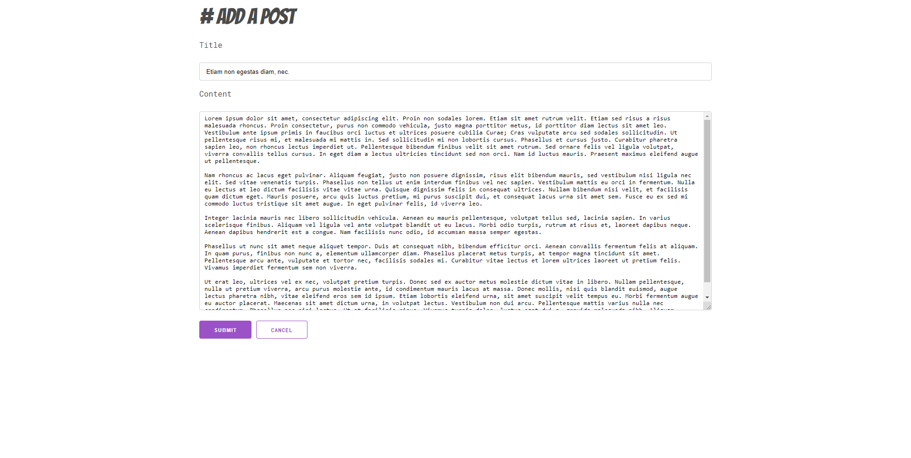

# A microblog made with Node Js

## Snapshots
#### Index Page

#### Index Page For Author

#### Post View Page

#### Add Post Page

#### Edit Post Page


## Installation
1. Clone this repository. (Optional: Delete the png files)
2. Create the database using the file ```db_schema.sql``` and set up a username, then update the database config.
3. Open the folder in the terminal and run ```npm start```.

## Configurations

Setting | Description
------------ | -------------
DB | Store the configuration for the database in a JSON object. E.g: host's address, username, password, etc. 
author  | Store a ```true``` or ```false``` value. The options for adding, editing and deleting a post are available if ```author``` is set ```true```. 


